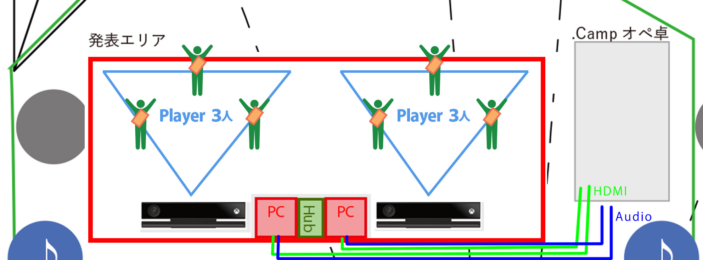

# 機材リスト SportsDesign.Camp Team-A

## 配線図

## 機材

| 機材名   | 消費電力 | 備考 | 個数 | コンセント |
| -------- | -------- | ---- | ---- | ----- |
| PC       | ~300W    | ノートPCを2台想定   | 2    | 必要  |
| KinectV2 | 36W      | PCからの接続の長さに制限アリ（最大5mくらい）| 2    | 必要  |
| Network Hub | ~10W     | もしかしたら、LanケーブルをPC同士直繋ぎするかもしれなくて、使わないかもしれないけど、念のため記載 | 1    | 必要  |
| Lanケーブル  | N/A      | PC同士をネットワーク接続するため | 1~3  | 不要  |
| LEDテープライト | ~15W(1A,12V,DC) | プレイエリアを夜でも視認性良く見せるためのモノ(5m) | 6 | 必要 |

## 仕様、注意点

### 映像、センシングについて

- 1台のPCにつきKinect1台までしか接続できないので、2台のPCを使う
- Kinectを接続している、左のPCから左用の映像と音声、右のPCから右用の映像と音声を出力する
- Kinect設置位置とKinectを接続するUSBケーブルの長さの関係から、PCを発表エリア中央に置くことになる
  - Kinectを接続するPCから映像を出力するので、発表エリア中央のPCからオペ卓まで、5~10mくらい、長めのHDMIケーブルが必要（2本）
- 有線Lanで左右のPCを繋ぎ、点数情報、ボールの左右エリア間の移動を同期する

### 音声について

- 左右それぞれのPCで左プレイエリアのSE、右プレイエリアのSEを出力する
  - それぞれのSEはスピーカーのLRのチャンネルに振り分ける
  - BGMは、音源を1つにして、LR両方から出力する
  - 左用SE、右用SE、BGMをそれぞれ出力し、ミックスする必要がある
    - 方法については検討中で、最終的にはステレオミニジャックにして、オペ卓に渡す